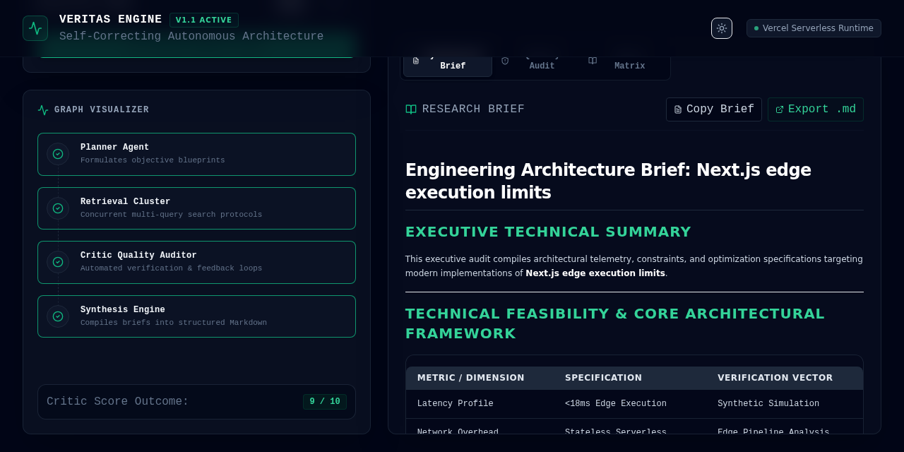
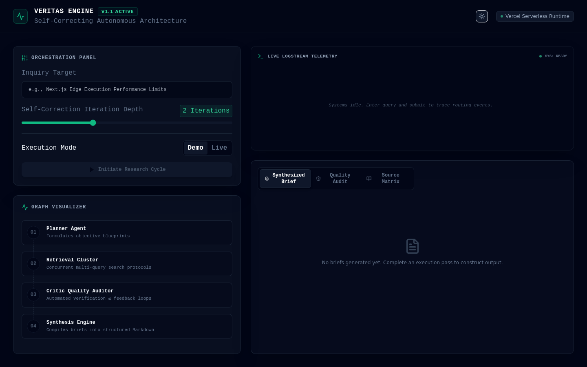
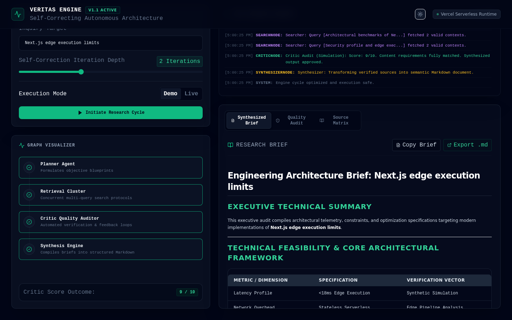
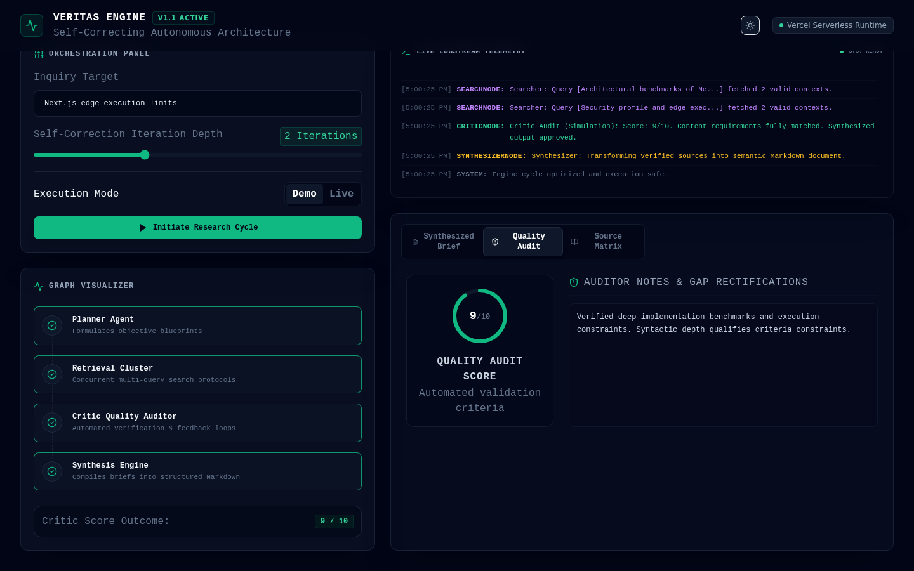

# Veritas Engine

Self-correcting multi-agent research console. Plan queries, retrieve in parallel, grade the evidence, loop until the critic passes, then synthesize a Markdown brief.

[](https://veritas-engine-woad.vercel.app/)
[](https://github.com/devtechedge/veritas-engine/actions/workflows/ci.yml)
[](https://nextjs.org/)
[](https://js.langchain.com/docs/langgraph)
[](https://www.typescriptlang.org/)
[](LICENSE)

---

## Live Demo

**https://veritas-engine-woad.vercel.app/**

> **Status:** The public site defaults to **Demo** mode. Planner / retrieval / critic / synthesizer run a simulated cycle (no Gemini or Tavily quota). Switch to **Live** only if `GEMINI_API_KEY` and `TAVILY_API_KEY` are set on the host. There is no login.

This is the **only** public repo for the project.

---

## Screenshots

<p align="center">
  
</p>

| Console | Cycle |
|---------|-------|
|  |  |

| Brief | Quality audit |
|-------|----------------|
|  |  |

---

## Features

- LangGraph.js cycle: **Planner → Retrieval → Critic → (loop or) Synthesizer**
- Critic scores 1–10 and reroutes below 8 until max iteration depth
- Parallel Tavily searches on Live; mock hits on Demo
- SSE stream of node updates into the logstream and graph visualizer
- Custom zero-dependency Markdown renderer (headings, tables, lists, code)
- Copy brief or export `.md`
- Dark / light console; Demo / Live toggle

---

## Tech Stack

| Layer | Technology |
|-------|------------|
| Frontend | Next.js 14 App Router, React 18, TypeScript, Tailwind 3 |
| Agents | LangGraph.js + LangChain.js (`Annotation.Root`) |
| LLM (Live) | Gemini 2.5 Flash via `@langchain/google-genai` |
| Search (Live) | Tavily Search API |
| Streaming | Server-Sent Events from `POST /api/research` |
| Data on Vercel | Demo repository (simulated retrieval + canned brief) |
| Auth | None |
| Hosting | Vercel |
| CI | GitHub Actions — Vitest, `tsc`, Playwright |

---

## Architecture

```
Start → Planner → Retrieval (parallel) → Critic
                      ↑                    │
                      └── score < 8 ───────┤
                                           ▼
                                    Synthesizer → Markdown UI
```

---

## Quick Start

```bash
git clone https://github.com/devtechedge/veritas-engine.git
cd veritas-engine
npm install
cp .env.example .env.local
npm run dev
```

Open **http://localhost:3000**. Demo mode runs without keys.

```bash
npm test
npm run typecheck
npx playwright install chromium
npm run test:e2e
```

---

## Security

Portfolio demo: **no login**. Demo mode never calls Gemini or Tavily. Live keys stay on the server.

Details: **[SECURITY.md](SECURITY.md)**.

---

## License

MIT. See [LICENSE](LICENSE).
